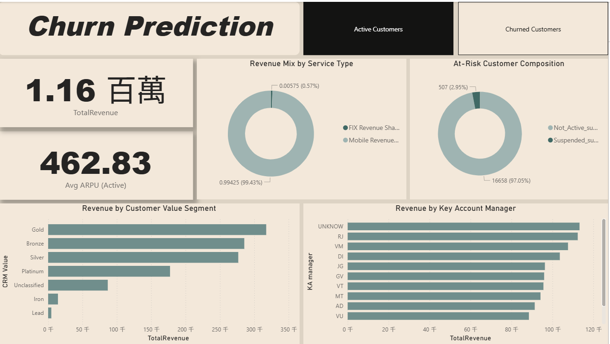
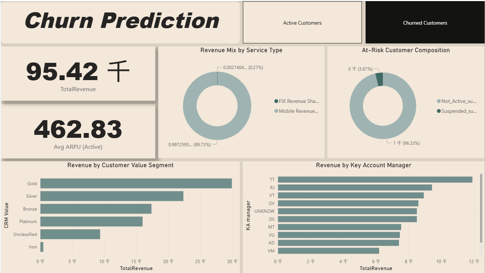

## Telecom Customer Churn Analysis

### Objective
Predict customer churn and visualize customer risk profiles
to support retention strategies.

### Tools
- Python (Pandas, LightGBM)
- Power BI Desktop
- GitHub

### Power BI Dashboard
> Screenshots below.  
> Open `powerbi/churn_dashboard.pbix` with Power BI Desktop to explore.

### Key Metrics(by shap)
- Total Revenue
- ARPU
- KA_client_count
